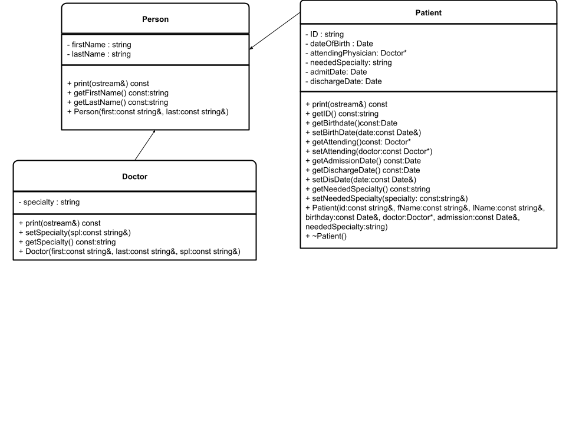
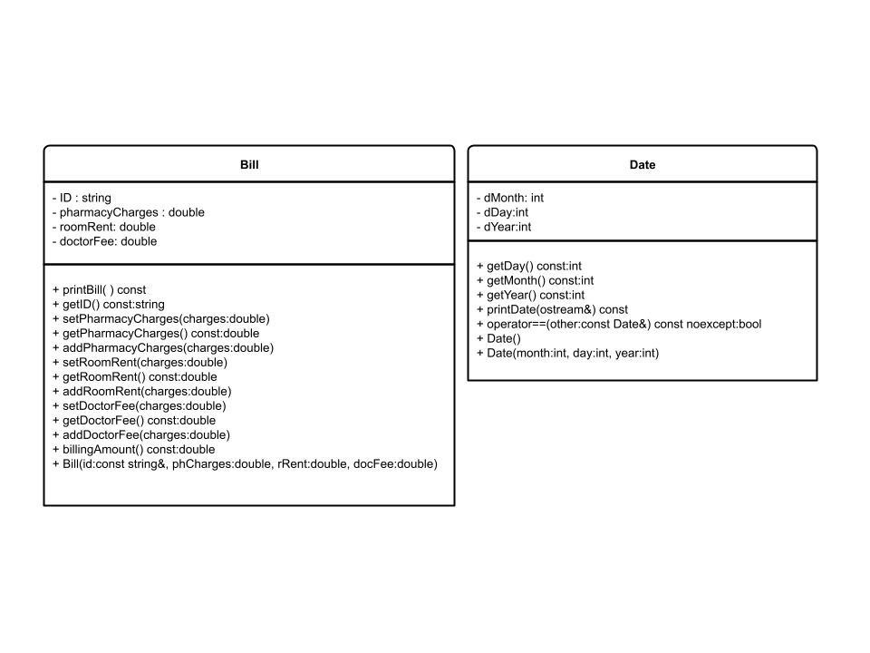
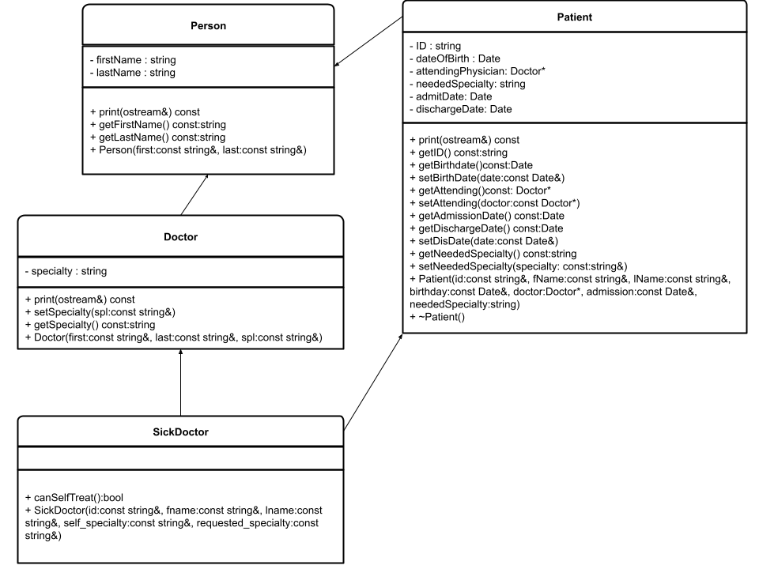

# HW05: Classes and Inheritance
## Problem Statement

In this exercise, you will design various classes and write a program to computerize the billing system of a hospital.
Treat this more like writing a library that another programmer will use than a full program.

Note: for this assignment, since certain classes do not have default constructors you must use initializer lists, as it is preferred in modern C++.

## Class Organization
Please refer to the UML diagrams of the classes provided in addition to the header files in the `include` directory.

Design the class `Doctor`, inherited from the class `Person`, defined above, with an additional data member to store a doctor's speciality.  Add appropriate constructors and member functions (see UML diagram) to initialize, access, and manipulate the data members.

Design the class `Bill` with data members to store a patient's ID and a patient's hospital charges, such as pharmacy charges for medicine, doctor's fee, and room charges. Add appropriate constructors and member functions (see UML diagram) to initialize, access, and manipulate the data members.

Design the class `Patient`, inherited from the class `Person`, with additional data members to store a patient's ID, age, date of birth, attending physician's name, the date when the patient was admitted in the hospital, and the date when the patient was discharged from the hospital. (Use the class `Date` to store the date of birth, admit date, discharge date, and the class `Doctor` to store the attending physician's name.) Add appropriate constructors and member functions to initialize, access, and manipulate the data members.

Assume all three integer values used to create `Date`s will form a valid date. 
`Date`'s default constructor should set its day, month, and year to 0.

This hospital is short on staff and allows medical practitioners to treat themselves (so healthy doctors can prioritize other patients).

Design the class `SickDoctor`, inherited from **both** `Patient` and `Doctor`. 
The `SickDoctor`'s constructor should call its parent `Patient`'s constructor. It should also set its parent `Doctor`'s constructor. This is to demonstrate multiple inheritance in C++.

`SickDoctor` will have one extra method called `canSelfTreat()` that returns true when its `getNeededSpecialty()` is equal to `getSpecialty()`

## Note
In order to receive full credit for this homework assignment you must complete:
- `src/bill.cpp`
- `src/date.cpp`
- `src/doctor.cpp`
- `src/patient.cpp`
- `src/person.cpp`
- `src/sickDoctor.cpp`

You may utilize `main.cpp` as sample driver code for your source. You may change the code to suit your needs during development. Please keep in mind that your class defintions should remain in the directory `src` and the declarations in `include`. You may also run the public test cases provided.

Make sure your last push is before the deadline. Your last push will be considered as your final submission when uploading your GitHub repository to Gradescope.
